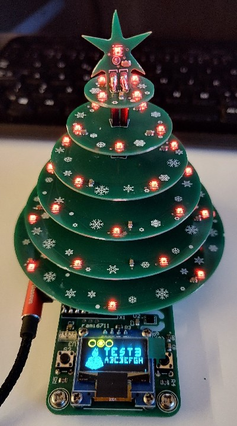
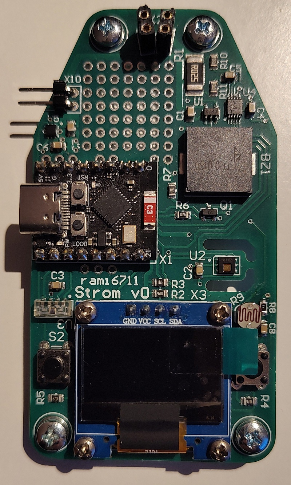

# StromPy project

This is a small PCB Christmas tree project. The design consists of circular circuit
boards that are connected by stackable connectors. Each PCB contains mini versions
of the WS2812 (size 2020). ESP32-C3 is used for control. Connected sensors measure
ambient light, temperature and humidity. The program can be controlled using two
buttons and a small OLED display.

[Manual](doc/manual.md) is only for Slovak guys. :smiley:

## HW notes
- [Strom schematic](doc/strom_sch.pdf)
- datasheet to [ESP32-C3 SuperMini](doc/ESP32-C3_SuperMini.pdf)

Mainboard - Top-side photo

| Pin | Connection |
|-----|------------|
|  0  | Analog input, ambient light from photo-resistor |
|  1  | Neopixel Output, 37 x WS2812 |
|  2  | GPIO2, free pad |
|  3  | GPIO3, free pad |
|  4  | PWM output, buzzer |
|  5  | Input, button SW2 |
|  6  | SDA, I2C data |
|  7  | SCL, I2C clock |
|  8  | PWM output, blue LED |
|  9  | NC, Boot button |
|  10 | Output, +5V enable, supply for WS2812 |
|  20 | Input, Alert from INA226 and TPS25200 |
|  21 | Input, button SW1 |

Devices at I2C bus:
| Device   | Addr8 | Addr7 | Driver |
|----------|-------|-------|--------|
| GME12864 |  0x78 |  0x3C | [ssd1306](src/ssd1306.md)
| VEML7700 |  0x20 |  0x10 | [veml7700](src/veml7700.md)
| HDC1080  |  0x80 |  0x40 | [hdc1080](src/hdc1080.md)
| INA226   |  0x8A |  0x45 | [ina226](src/ina226.md)

## SW notes
- software is written in [micropython](https://micropython.org/)
- ESP32-C3 is flashed with variant [LOLIN_C3_MINI](https://micropython.org/download/LOLIN_C3_MINI/)

