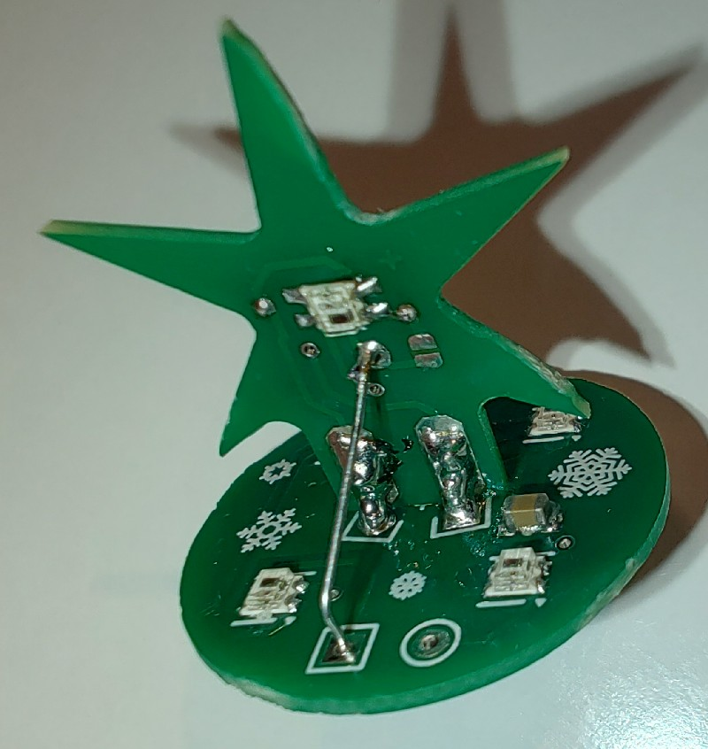
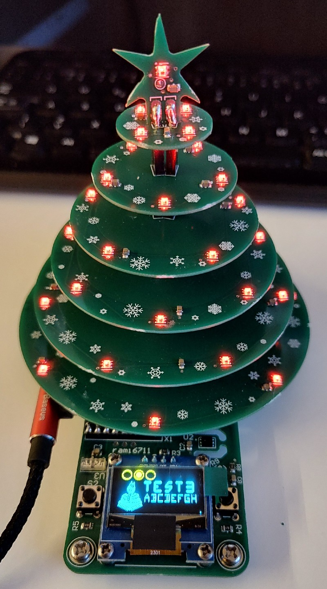

# Manual

Manual je len po Slovensky.

Este taka poznamka k tym stohovatelnym konektorm:
- tie v balicku su od Cinana a tak kvalita je trochu slabsia, ked sa stromcek zaknise, tak stracaju LED-ky stavu a zhasnu.
- existuju lepsie konektory, ale tie by som musel skor objednat a to sa uz nestihalo:
    - [Fischer Elektronik BL9](https://www.fischerelektronik.de/web_fischer/en_GB/connectors/G02/Female%20headers/VA/BL92/index.xhtml)
    - [Fischer Elektronik BL13](https://www.fischerelektronik.de/web_fischer/en_GB/connectors/G02/Female%20headers/VA/BL132/index.xhtml)
    - [Samtec ESQ-102-14-G-S](https://www.samtec.com/products/esq-102-14-g-s)
Mozno by stalo za to jednotlive kruzky napajkovat na hrubsie droty ktore vojdu do konektora X2 na doske A. Strom sa nebude dat rozobrat, ale stale sa da odpojit od zakladovej dosky.

## Oznacenie PCB

## ToDo list
1.	Dosky treba rozdeliť a opilovať
2.	~~LED D2 (odpad medzi doskami C-D-E) vypájkovať a osadiť na pozíciu D2` (zospodu H)~~
3.	~~Osadiť R12 = 220k / 0805 (spodok A)~~
4.	~~Osadiť R13 = 47k / 0805 (spodok A)~~
5.	~~Vymeniť R8 za 47k / 0805~~
6.	Osadiť na R9 fotorezistor 

7.	Na display naskrutkovať distančný stĺpik
8.	Vložiť display do dosky A, zaskrutkovať, napájkovať
9.	Na modul ESP32 napájkovať pinheadre
10.	Osadiť modul ESP32 do doky A 

11.	Naskrutkovať distančné stĺpiky na spodok dosky A (ako nožičky)
12.	Na doske A osadiť X2 – 2x dutinková lišta 

13.	Na doskách B, C, D, E, F osadiť stohovacie konektory 
- do X2 dat 2x pinheader, nastoknúť dva stohovacie konektory 
- nasunúť PCB dosku LED-kami dolu a tak zapájkovať 
14.	Na dosku G odspodu osadiť 2x pinheader (pozícia X4) 

15.	Na dosku G zhora na pozíciu X4 osadiť dosku H (pozor na orientáciu, D1 svieti na C52) 
 

16.	Drôtikom spojiť J1 a J2 

17.	Na pozíciu J4, J6, J8, J10 a J12 osadiť jeden pin precíznej lišty
18.	Na pozíciu J3, J5, J7, J9 a J11 ale zospodu osadiť drôtik
19.	Zasunúť G do F, F do E, E do D, D do C, C do B
20.	Drôtik J3 zasunúť do J4, J5 do J6, J7 do J8, J9 do J10, J11 do J12 

21.	Pripojiť USB-C káblik do modulu ESP32
22.	Finálne B do A a Strom je hotový
23.	Nainštalovať program Thonny (https://thonny.org/)
24.	Pripojiť USB káblik do PC, demo by sa malo spustiť a overiť, ci je všetko ok.
Výpis treba kontrolovať v programe Thonny. 

25.	Ak je všetko ok, hor sa na Python – naprogramuj si svoj stromček podľa seba.

## Poznamky
- Pinheader X10 sluzi na prepinanie medzi Imax 500mA (open) vz 2A (closed). Jumper netreba osadit, aspon nie hned. Moze sa pripadne dat len drotik.
- Zabudol som, ze treba osadit aj tlacitka SW1 a SW2. Hocikedy. :smiley:
- Na moduloch ESP32-C3 je napalena aktualna verzia MicroPython v1.24.1 (2024-11-29) pre LOLIN_C3_MINI
